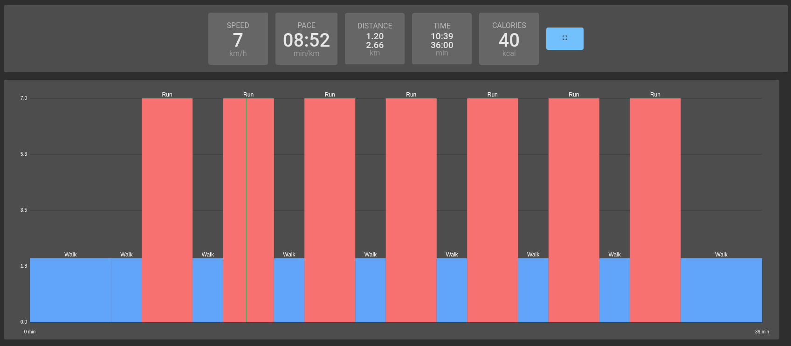

# 🏃‍♂️ Treadmill Web Controller

I bought a treadmill, but its official app required **location permissions** I didn’t want to grant.  
So I built this **web-based treadmill controller** that runs entirely in your browser — no location access required!  

Check it out here: [Treadmill Web App](https://david-westreicher.github.io/treadmill/)

  

---

## ✨ Features

- Control your treadmill **directly from the browser**
- Connect via **Bluetooth Low Energy (BLE)**
- Works on **desktop or mobile browsers** with BLE support
- Minimal, lightweight UI built with **Svelte**

---

## 🛠️ Implementation Details

- **Frontend:**  
  - Built entirely with [Svelte](https://svelte.dev/) for fast reactivity and minimal bundle size
  - Simple and responsive UI for treadmill controls

- **Bluetooth Low Energy (BLE) Connection:**  
  - Uses the [`navigator.bluetooth`](https://developer.mozilla.org/en-US/docs/Web/API/Navigator/bluetooth) API  
  - BLE allows direct communication with your treadmill’s device, reading and writing characteristics
  - Example of connection flow:
    1. Request device: `navigator.bluetooth.requestDevice({ filters: [{ services: ['treadmill_service_uuid'] }] })`
    2. Connect to GATT server: `device.gatt.connect()`
    3. Access services and characteristics for reading speed, incline, or sending commands
  - No additional native apps or drivers required — fully web-based  

- **Data Flow & Control:**  
  - The web page acts as a **controller interface**  
  - Updates treadmill speed, start/stop, incline in real-time  
  - BLE characteristics are read/written via JavaScript in the browser  

---

## ⚡ How to Use

1. Open the app: [https://david-westreicher.github.io/treadmill/](https://david-westreicher.github.io/treadmill/)  
2. Select your track you want to run
3. A dialog should open to connect to a BLE device.
4. Start/Stop from your tablet.

> Works on modern browsers with BLE support (Chrome, Edge, or mobile Chromium-based browsers).

---

## 📚 Tech Stack

- **Svelte** – reactive UI & SPA architecture  
- **Web Bluetooth API (`navigator.bluetooth`)** – low-level BLE communication  
- **TypeScript** – application logic and BLE control  
